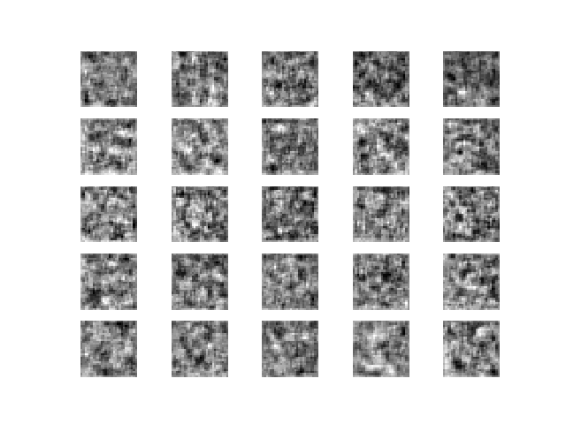

GAN Experiment with stanford-cars (Kaggle)
==========================================

## Output from 28x28 Stanford Cars



```
  100.00  ┼                                                                        ╭╮
   95.00  ┤╭╮╭╮  ╭╮╭─╮        ╭╮╭──╮  ╭╮              ╭╮        ╭╮      ╭╮         ││╭╮   ╭╮   ╭─╮ ╭╮╭╮   ╭╮╭╮
   90.00  ┤││││╭╮│││ ╰╮    ╭╮ │││  │  ││  ╭╮ ╭──╮     ││    ╭╮  ││╭╮ ╭╮╭╯│ ╭╮ ╭╮╭─╮││││   ││╭╮ │ │ │╰╯╰╮ ╭╯││╰
   85.00  ┼╯││││││╰╯  ╰──╮ │╰╮│╰╯  ╰╮ │╰──╯│╭╯  │  ╭╮╭╯│   ╭╯│  ││││ │││ │ │╰─╯││ ││╰╯│   ││││ │ │ │   │╭╯ ││
   80.00  ┤ ││││╰╯       ╰╮│ ││     ╰╮│    ││   ╰╮╭╯││ │   │ ╰──╯│││ │││ │ │   ││ ╰╯  │ ╭─╯│││ │ │╭╯   ││  ╰╯
   75.00  ┤ ││││          ││ ╰╯      ╰╯    ││    ││ ││ │   │     │││╭╯││ ╰╮│   ││     ╰╮│  │││ │ ││    ╰╯
   70.00  ┤ ││││          ││               ││    ││ ╰╯ │ ╭╮│     ╰╯││ ││  ││   ││      ╰╯  ││╰╮│ ╰╯
   65.00  ┤ ││╰╯          ╰╯               ╰╯    ││    ╰─╯││       ││ ││  ││   ╰╯          ││ ││
   60.00  ┤ ╰╯                                   ││       ╰╯       ╰╯ ╰╯  ││               ││ ││
   55.00  ┤                                      ││                       ╰╯               ╰╯ ╰╯
   50.00  ┤                                      ││
   45.00  ┤                                      ╰╯
   40.00  ┤
   35.00  ┤
   30.00  ┤
   25.00  ┤
   20.00  ┤
   15.00  ┤
   10.00  ┤
    5.00  ┤
    0.00  ┤
39999 [D loss: 0.209843, acc.: 92.58%] [G loss: 2.944080]]
```
